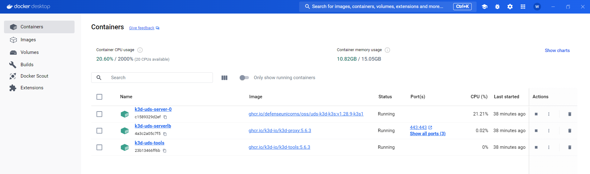
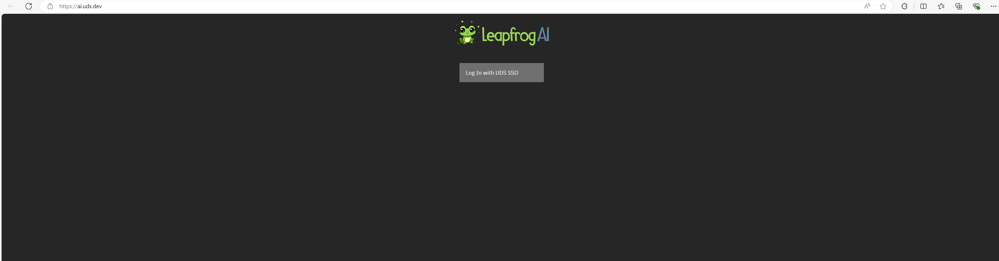
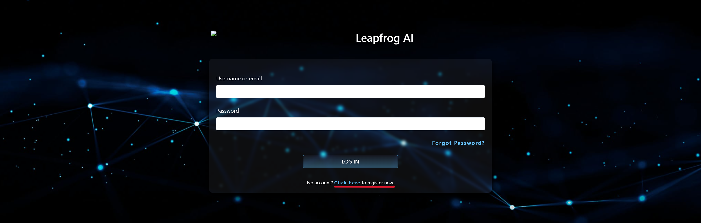
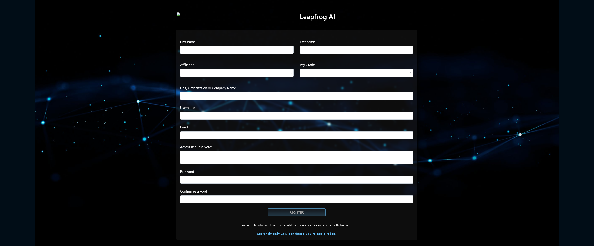
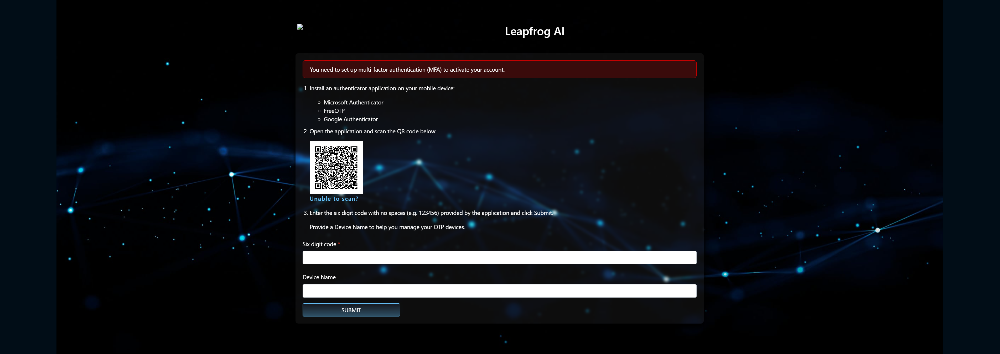
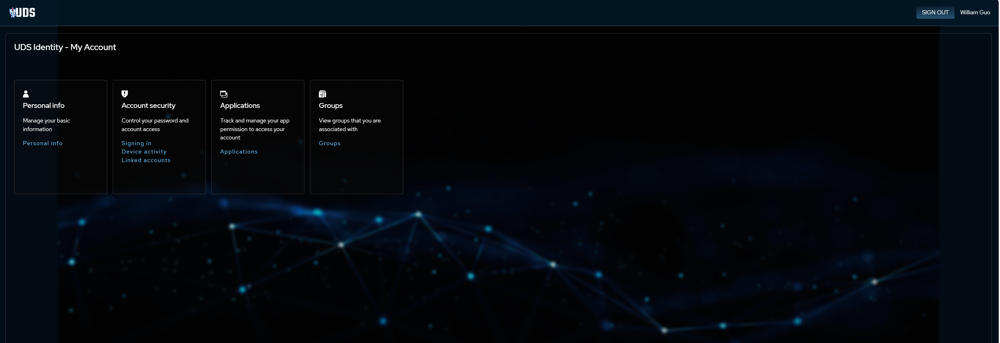
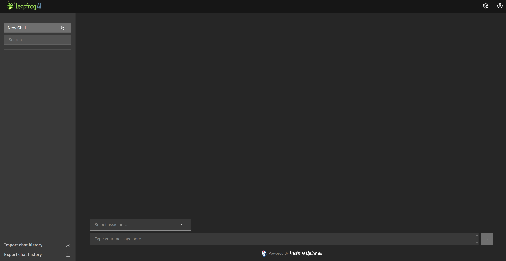

# LeapfrogAI Deployment Guide (Tuesday, June 26 2024)

## Introduction

LeapfrogAI grants the valuable ability to self-host an AI platform and gain access to generative AI capabilities without compromising data independence and security. In this guide, I will demonstrate how to deploy LeapfrogAI and view its UI on a KBR machine. Recognize that the majority of the requirements section requires admin rights to install so please ensure you possess those priviledges beforehand. For more information, reference the official [documentation](https://docs.leapfrog.ai/docs/local-deploy-guide/quick_start/).  

## Requirements
> [Docker Desktop](https://docs.docker.com/engine/install/)
>   
> [WSL2 - Ubuntu](https://www.youtube.com/watch?v=YByZ_sOOWsQ)
> 
> 1) Search for Command Prompt and "Run as administrator"
> 
> 2) Run the following command to install the Ubuntu distribution
>    ```
>    wsl --install -d Ubuntu
>    ```
> 3) Open Ubuntu
> 4) Enter a new UNIX username and password to get started
>
> [K3D](https://k3d.io/v5.6.3/#releases)
> 1) In Ubuntu, run the following command to install k3d
> 
>    ```
>    wget -q -O - https://raw.githubusercontent.com/k3d-io/k3d/main/install.sh | bash
>    ```
> [UDS CLI](https://github.com/defenseunicorns/uds-cli)
>
> 1) In Ubuntu, run the following commands to install Homebrew
> 
>     ```
>    sudo apt-get update
>    sudo apt-get install build-essential procps curl file git
>    /bin/bash -c "$(curl -fsSl https://raw.githubusercontent.com/Homebrew/install/master/install.sh)"
>    ```
> 2) Add Homebrew to your PATH
>    
>    ```
>    (echo; echo 'eval "$(/home/linuxbrew/.linuxbrew/bin/brew shellenv)"') >> ~/.profile
>    eval "$(/home/linuxbrew/.linuxbrew/bin/brew shellenv)"
>    ```
> 3) Check if successfully installed Homebrew
>    
>    ```
>    brew --version
>    brew doctor
>    ```
> 4) Install UDS CLI
>    
>    ```
>    brew tap defenseunicorns/tap && brew install uds
>    ```

## Instructions 

In Ubuntu, navigate to an appropriate working directory to clone the [LeapfrogAI Github Repository](https://github.com/defenseunicorns/leapfrogai.git).
```
git clone https://github.com/defenseunicorns/leapfrogai.git
```
Change directories into *leapfrogai* and run the following commands to deploy K3D and LeapfrogAI bundle on either CPU or GPU. Note that GPU deployments will in-general possess much faster performance than CPU in terms of generative tasks. 

*If you run into errors regarding docker daemon during the deployment process, ensure that you have Docker Desktop open and ready for use.*

### CPU
```
cd uds-bundles/latest/cpu/
uds create .
uds deploy k3d-core-slim-dev:0.22.2  # be sure to check if a newer version exists
uds deploy uds-bundle-leapfrogai-*.tar.zst --confirm
```
### GPU
```
cd uds-bundles/latest/gpu/
uds create .
uds deploy k3d-core-slim-dev:0.22.2 --set K3D_EXTRA_ARGS="--gpus=all --image=ghcr.io/justinthelaw/k3d-gpu-support:v1.27.4-k3s1-cuda" # be sure to check if a newer version exists
uds deploy uds-bundle-leapfrogai-*.tar.zst --confirm
```

Ensure on Docker Desktop that your k3d containers are actively running without issue. 
<br/><br/>


## Access the UI
1) Connect to the Keycloak admin panel
   
    * Run the following command to obtain a port-forwarded tunnel. Open the provided localhost URL to create an admin account.
      
      ```
      uds zarf connect keycloak
      ```
      
      
2) Open [ai.uds.dev](https://ai.uds.dev/) and click "Login using SSO"

   
   
3) In the login screen, select "Register Here"

   
   
4) Fill out the resulting form. *To reach 100% on the anti-bot detection, simply move around your cursor*

   
   
5) Open Microsoft Authenticator to scan the provided QRcode and complete the subsequent MFA instructions

   
   
6) Open [sso.uds.dev](https://sso.uds.dev/) and login using your newly-created admin account's username and password

   
   
7) To access the UI, head back to [ai.uds.dev](https://ai.uds.dev/) and login as your registered user

   

## Clean-up/Fresh Install

Run the following commands in order to perform a clean-up or fresh install of your deployments.

```
k3d cluster delete uds  # kills a running uds cluster
uds zarf tools clear-cache # clears the Zarf tool cache
rm -rf ~/.uds-cache # clears the UDS cache
docker system prune -a -f # removes all hanging containers and images
docker volume prune -f # removes all hanging container volumes
```
