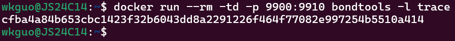
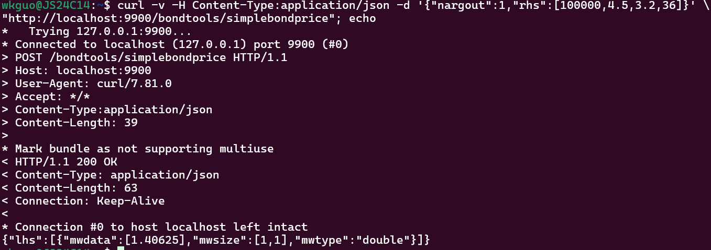
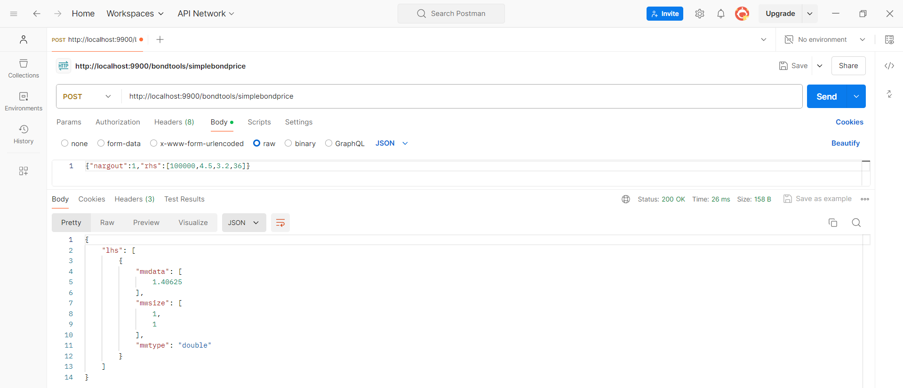
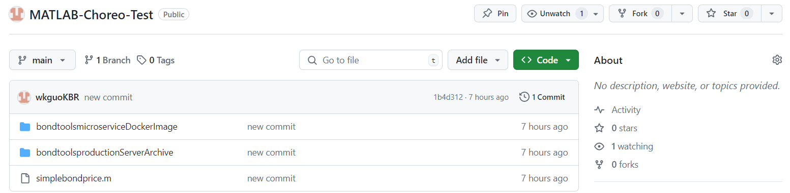
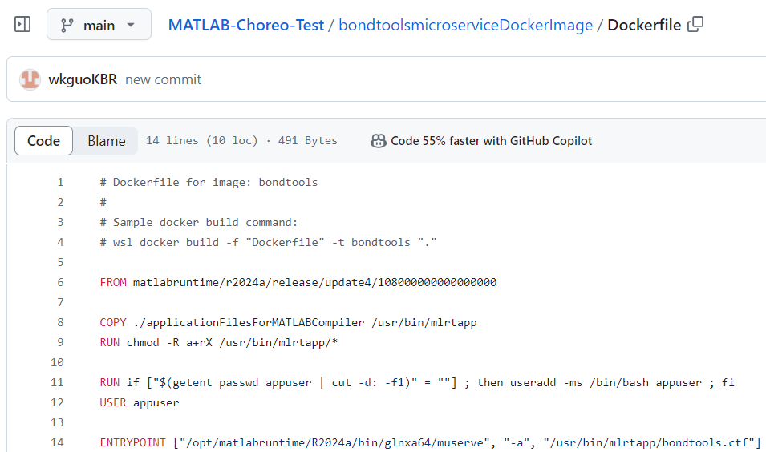
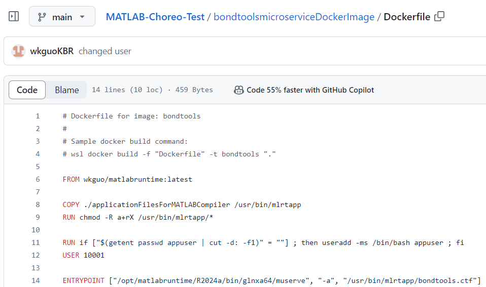

# Deploying MATLAB Microservice Docker Image to Choreo (Wednesday, July 17 2024)

## Introduction

This guide will walk you through how to create a microservice Docker image of a MATLAB function using MATLAB Compiler SDK, deploying it to Choreo as a service, and then exposing it as an API. We'll be making use of a variety of existing resources/documentation throughout this guide, which will all be compiled into a list at the bottom for future reference or more details.

## Instructions

### Step 1. Create Microservice Docker Image in MATLAB

#### Requirements
> - [MATLAB](https://www.mathworks.com/products/matlab.html), [MATLAB Compiler](https://www.mathworks.com/products/compiler.html), and [MATLAB Compiler SDK](https://www.mathworks.com/products/matlab-compiler-sdk.html)
> 
> - [Docker Desktop](https://docs.docker.com/engine/install/)
> 
> - [WSL2 - Ubuntu](https://www.youtube.com/watch?v=YByZ_sOOWsQ)

1) **Create MATLAB Function**
   
   Identify the MATLAB function you are interested in packaging. For the purposes of the rest of the guide, we will use the function `simplebondprice.m` with the following code:
   ```
   function price = simplebondprice(face_value, coupon_payment, interest_rate, num_payments)
    M = face_value;
    C = coupon_payment;
    N = num_payments;
    i = interest_rate;

    price = C * ( (1 - (1 + i)^-N) / i) + M * (1 + i)^-N;
   end
   ```
   We can try out the function using the MATLAB Command Prompt. Enter `simplebondprice(100000,4.5,3.2,36)`
   ```
   >> simplebondprice(100000,4.5,3.2,36)

   ans =
       1.4062
   ```
   
2) **Package Function as into a Deployable Code Archive**

   The next step is to package `simplebondprice` into a code archive with the `compiler.build.productionServerArchive` function.

   ```
   >> mservice = compiler.build.productionServerArchive('simplebondprice.m','ArchiveName','bondtools','Verbose','on')

   mservice = 
       Results with properties:
                        BuildType: 'productionServerArchive'
                            Files: {'C:\Users\K160458\Documents\bondtoolsproductionServerArchive\bondtools.ctf'}
          IncludedSupportPackages: {}
                          Options: [1×1 compiler.build.ProductionServerArchiveOptions]
   ```

   When fully built, you should see the folder `bondtoolsproductionServerArchive` in your current working directory which holds the deployable archive.
   
3) **Build the Docker Image**

   We can construct our microservice Docker image with the `mservice` object and function `compiler.package.microserviceDockerImage`. You will want Docker Desktop to be up and running before submitting the command. Furthermore, please note that your first time building a Docker image with this function will take a couple of minutes.

   ```
   >> compiler.package.microserviceDockerImage(mservice,'ImageName','bondtools')
   Creating Dockerfile for image 'matlabruntimebase/r2024a/release/update4' at 'C:\Users\K160458\Documents\bondtoolsmicroserviceDockerImage\matlabruntimebase\Dockerfile.deps'.
   .
   .
   .
   For help getting started with microservice images, please read:

   C:\Users\K160458\Documents\bondtoolsmicroserviceDockerImage\GettingStarted.txt
   ```

   Once finished, you should have access to a helpful `GettingStarted.txt` that'll provide information on how to run the microservice image and use the curl command to make an HTTP request.
   
4) **Test the Microservice**

   Verify that you possess the `bondtools` image in your Linux (ex. Ubuntu) terminal.
   
   ```
   docker images
   ```

   

   Run the microservice image in Docker on port 9900.

   ```
   docker run --rm -td -p 9900:9910 bondtools -l trace
   ```

   

   Now that our service is running, let's test it using the `curl` command to send a JSON request body with input arguments [100000,4.5,3.2,36] to the service through port 9900.

   ```
   curl -v -H Content-Type:application/json -d '{"nargout":1,"rhs":[100000,4.5,3.2,36]}' \
   "http://localhost:9900/bondtools/simplebondprice"; echo
   ```

   

   You can also use external tools such as Postman to send in requests if you prefer.

   
   
### Step 2. Deploy Microservice to Choreo

1) **Save Docker Image into GitHub Repository**

   To continue deploy our microservice from *Step 1. Create Microservice Docker Image in MATLAB*, we first compile it into a (preferably public) GitHub repository. Access the example repo [MATLAB-Choreo-Test](https://github.com/wkguoKBR/MATLAB-Choreo-Test) to ensure yours is ultimately setup similarly if not the same.

   For starters, create a new repository and orient it like so:

2) **Update Dockerfile in Microservice Docker Image Folder**

   Navigate to the folder with your microservice Docker image, which in this case is `bondtoolsmicroserviceDockerImage`. Here, you should see a combination of 5 different files/folders.
   - `applicationFilesForMATLABCompiler`: Contains *bondtools.ctf*, which is the code archive and contains our MATLAB code
   - `matlabruntime`: Contains *Dockerfile.runtime* which runs a MATLAB Runtime image using Docker, allowing the execution of MATLAB applications without the need to have MATLAB installed
   - `matlabruntimebase`: Contains *Dockerfile.deps* which handles the dependencies and essential files required to setup the MATLAB Runtime environment
   - `Dockerfile`: Creates a Docker image named `bondtools` that holds our compiled MATLAB application
   - `GettingStarted.txt`: Provides a simple introduction on how to use the `bondtoolsmicroserviceDockerImage` and run the microservice

   
  
   Open the `Dockerfile` and observe Line 6: `FROM matlabruntime/r2024a/release/update4/108000000000000000`. This line is responsible for specifying the base image for the Docker image, using a specific version of the MATLAB Runtime environment. When you run `Dockerfile`, this base image is actually built ahead-of-time by first running `Dockerfile.deps` and then `Dockerfile.runtime*. In a local environment, this allows for the usage of a minimal MATLAB Runtime package to assist in compiling and executing our MATLAB applications.

   

   However, when our microservice is deployed to Choreo at its current state, we'll encounter an error at Line 6 during runtime because it doesn't recognize our base image of `matlabruntime/r2024a/release/update4/108000000000000000`. This is due to the fact that the base image is not first built by running `Dockerfile.deps` and `Dockerfile.runtime` ahead of `Dockerfile`.

   A solution to this problem is to use an image publicly accessible on Docker Hub that contains the MATLAB Runtime. There are two ways:
   1) Use an existing image such as [wkguo/matlabruntime:latest](https://hub.docker.com/r/wkguo/matlabruntime)
   2) Create and push your own MATLAB Runtime image onto Docker Hub

   If you choose Option 1, you need to make three changes to `Dockerfile`:
   1) Line 6 to `FROM wkguo/matlabruntime:latest`
   2) Line 12 to `USER 10001` (Note: In Choreo, a valid USER ID is between [10000-20000](https://wso2.com/choreo/docs/develop-components/deploy-a-containerized-application/))
   3) Line 14 such that the MATLAB Runtime version matches that of what `wkguo/matlabruntime:latest` possesses, which is `R2024a`.
   <br></br>
   ```
   6       FROM wkguo/matlabruntime:latest
   .
   .
   .
   12      USER 10001
   .  
   14      ENTRYPOINT ["/opt/matlabruntime/R2024a/bin/glnxa64/muserve", "-a", "/usr/bin/mlrtapp/bondtools.ctf"]`
   ```

   Here is what your base `Dockerfile` should look like:

   

   
3) **Add in .choreo/endpoints.yaml and openapi.yaml**

### Step 3. Expose Choreo Service as an API

## Resources
