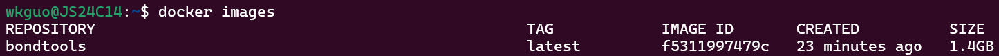
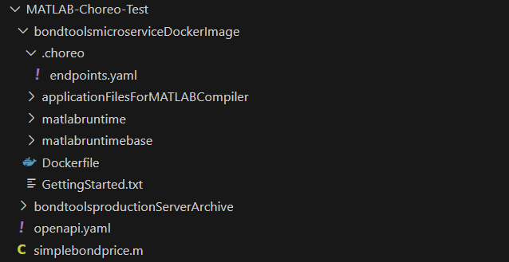

# Deploying MATLAB Microservice Docker Image to Choreo (Wednesday, July 17 2024)

## Introduction

This guide will walk you through how to create a microservice Docker image of a MATLAB function using MATLAB Compiler SDK, deploying it to Choreo as a service, and then exposing it as an API. We'll be making use of a variety of existing resources/documentation throughout this guide, which will all be compiled into a list at the bottom for future reference or more details.

## Instructions

### Step 1. Create Microservice Docker Image in MATLAB

#### Requirements
> - [MATLAB](https://www.mathworks.com/products/matlab.html), [MATLAB Compiler](https://www.mathworks.com/products/compiler.html), and [MATLAB Compiler SDK](https://www.mathworks.com/products/matlab-compiler-sdk.html)
> 
> - [Docker Desktop](https://docs.docker.com/engine/install/)
> 
> - [WSL2 - Ubuntu](https://www.youtube.com/watch?v=YByZ_sOOWsQ)

1) **Create MATLAB Function**
   
   Identify the MATLAB function you are interested in packaging. For the purposes of the rest of the guide, we will use the function `simplebondprice.m` with the following code:
   ```
   function price = simplebondprice(face_value, coupon_payment, interest_rate, num_payments)
    M = face_value;
    C = coupon_payment;
    N = num_payments;
    i = interest_rate;

    price = C * ( (1 - (1 + i)^-N) / i) + M * (1 + i)^-N;
   end
   ```
   We can try out the function using the MATLAB Command Prompt. Enter `simplebondprice(100000,4.5,3.2,36)`
   ```
   >> simplebondprice(100000,4.5,3.2,36)

   ans =
       1.4062
   ```
   
2) **Package Function as into a Deployable Code Archive**

   The next step is to package `simplebondprice` into a code archive with the `compiler.build.productionServerArchive` function.

   ```
   >> mservice = compiler.build.productionServerArchive('simplebondprice.m','ArchiveName','bondtools','Verbose','on')

   mservice = 
       Results with properties:
                        BuildType: 'productionServerArchive'
                            Files: {'C:\Users\K160458\Documents\bondtoolsproductionServerArchive\bondtools.ctf'}
          IncludedSupportPackages: {}
                          Options: [1×1 compiler.build.ProductionServerArchiveOptions]
   ```

   When fully built, you should see the folder `bondtoolsproductionServerArchive` in your current working directory which holds the deployable archive.
   
3) **Build the Docker Image**

   We can construct our microservice Docker image with the `mservice` object and function `compiler.package.microserviceDockerImage`. You will want Docker Desktop to be up and running before submitting the command. Furthermore, please note that your first time building a Docker image with this function will take a couple of minutes.

   ```
   >> compiler.package.microserviceDockerImage(mservice,'ImageName','bondtools')
   Creating Dockerfile for image 'matlabruntimebase/r2024a/release/update4' at 'C:\Users\K160458\Documents\bondtoolsmicroserviceDockerImage\matlabruntimebase\Dockerfile.deps'.
   .
   .
   .
   For help getting started with microservice images, please read:

   C:\Users\K160458\Documents\bondtoolsmicroserviceDockerImage\GettingStarted.txt
   ```

   Once finished, you should have access to a helpful `GettingStarted.txt` that'll provide information on how to run the microservice image and use the curl command to make an HTTP request.
   
4) **Test the Microservice**

   Verify that you possess the `bondtools` image in your Linux (ex. Ubuntu) terminal.
   
   ```
   docker images
   ```

   

   Run the microservice image in Docker on port 9900.

   ```
   docker run --rm -td -p 9900:9910 bondtools -l trace
   ```

   

   Now that our service is running, let's test it using the `curl` command to send a JSON request body with input arguments [100000,4.5,3.2,36] to the service through port 9900.

   ```
   curl -v -H Content-Type:application/json -d '{"nargout":1,"rhs":[100000,4.5,3.2,36]}' \
   "http://localhost:9900/bondtools/simplebondprice"; echo
   ```

   

   You can also use external tools such as Postman to send in requests if you prefer.

   
   
### Step 2. Setup GitHub Repo

1) **Save Docker Image into GitHub Repository**

   To continue deploy our microservice from *Step 1. Create Microservice Docker Image in MATLAB*, we first compile it into a (preferably public) GitHub repository. Access the example repo [MATLAB-Choreo-Test](https://github.com/wkguoKBR/MATLAB-Choreo-Test) to ensure yours is ultimately setup similarly if not the same.

   For starters, create a new repository and orient it like so:

2) **Update Dockerfile in Microservice Docker Image Folder**

   Navigate to the folder with your microservice Docker image, which in this case is `bondtoolsmicroserviceDockerImage`. Here, you should see a combination of 5 different files/folders.
   - `applicationFilesForMATLABCompiler`: Contains *bondtools.ctf*, which is the code archive and contains our MATLAB code
   - `matlabruntime`: Contains *Dockerfile.runtime* which runs a MATLAB Runtime image using Docker, allowing the execution of MATLAB applications without the need to have MATLAB installed
   - `matlabruntimebase`: Contains *Dockerfile.deps* which handles the dependencies and essential files required to setup the MATLAB Runtime environment
   - `Dockerfile`: Creates a Docker image named `bondtools` that holds our compiled MATLAB application
   - `GettingStarted.txt`: Provides a simple introduction on how to use the `bondtoolsmicroserviceDockerImage` and run the microservice

   
  
   Open the `Dockerfile` and observe Line 6: `FROM matlabruntime/r2024a/release/update4/108000000000000000`. This line is responsible for specifying the base image for the Docker image, using a specific version of the MATLAB Runtime environment. When you run `Dockerfile`, this base image is actually built ahead-of-time by first running `Dockerfile.deps` and then `Dockerfile.runtime*. In a local environment, this allows for the usage of a minimal MATLAB Runtime package to assist in compiling and executing our MATLAB applications.

   

   However, when our microservice is deployed to Choreo at its current state, we'll encounter an error at Line 6 during runtime because it doesn't recognize our base image of `matlabruntime/r2024a/release/update4/108000000000000000`. This is due to the fact that the base image is not first built by running `Dockerfile.deps` and `Dockerfile.runtime` ahead of `Dockerfile`.

   A solution to this problem is to use an image publicly accessible on Docker Hub that contains the MATLAB Runtime. There are two ways:
   1) Use an existing image such as [wkguo/matlabruntime:latest](https://hub.docker.com/r/wkguo/matlabruntime)
   2) Create and push your own MATLAB Runtime image onto Docker Hub

   If you choose Option 1, you need to make three changes to `Dockerfile`:
   1) Line 6 to `FROM wkguo/matlabruntime:latest`
   2) Line 12 to `USER 10001` (Note: In Choreo, a valid USER ID is between [10000-20000](https://wso2.com/choreo/docs/develop-components/deploy-a-containerized-application/))
   3) Line 14 such that the MATLAB Runtime version matches that of what `wkguo/matlabruntime:latest` possesses, which is `R2024a`.
   <br></br>
   ```
   6       FROM wkguo/matlabruntime:latest
   .
   .
   .
   12      USER 10001
   .  
   14      ENTRYPOINT ["/opt/matlabruntime/R2024a/bin/glnxa64/muserve", "-a", "/usr/bin/mlrtapp/bondtools.ctf"]`
   ```

   Here is what your base `Dockerfile` should look like:

   

   
3) **Add in .choreo/endpoints.yaml and openapi.yaml**

   Our next step is to include two files into our GitHub repository: `.choreo/endpoints.yaml` and `openapi.yaml`.
   - `.choreo/endpoints.yaml`: A Choreo-specific configuration that tells Choreo how to expose the service
   - `openapi.yaml`: Provides an OpenAPI specification that describes our API definition, including available endpoints and operations

   First, let's handle `.choreo/endpoints.yaml`. The `.choreo` directory needs to be placed at the root of the Docker build context path. In our case, it will be at the same level as our `Dockerfile` in `bondtoolsmicroserviceDockerImage`.

    Create a new file named `endpoints.yaml` inside of `.choreo`. Populate it with the following code:
   ```
   # +required Version of the endpoint configuration YAML
   version: 0.1

   # +required List of endpoints to create
   endpoints:
     # +required Unique name for the endpoint. (This name will be used when generating the managed API)
   - name: MATLAB Microservice Test
     # +required Numeric port value that gets exposed via this endpoint
     port: 9910
     # +required Type of the traffic this endpoint is accepting. Example: REST, GraphQL, etc.
     # Allowed values: REST, GraphQL, GRPC, UDP, TCP
     type: REST
     # +optional Network level visibility of this endpoint. Defaults to Public
     networkVisibility: Public
     # +optional Context (base path) of the API that is exposed via this endpoint.
     context: /
     # +optional Schema file path to openapi.yaml
     schemaFilePath: ../openapi.yaml
   ```

   Noticed we've defined `schemaFilePath: ../openapi.yaml`, which means we have to place our `openapi.yaml` file one level up that of `.choreo`. Populate it with the following:

   ```
   openapi: 3.0.0
   info:
     title: MATLAB Microservice Test
     version: 1.0.0
   paths:
     /bondtools/simplebondprice:
       post:
         tags:
           - default
         summary: Call simplebondprice Matlab Function
         requestBody: 
           required: true
           content:
             application/json:
               schema:
                 type: object
                 properties:
                   nargout:
                     type: integer
                     format: int64
                     example: 1
                   rhs:
                     type: array
                     items:
                       type: integer
                       format: int64
                       example: 1
                     minItems: 4
         responses:
           "200":
             description: Successful response
             content:
               application/json:
                 schema:
                   type: object
                   properties:
                     lhs: 
                       type: array
                       items:
                         type: object
                         properties:
                           mwdata:
                             type: array
                             items:
                               type: integer
                               format: int64
                           mwsize:
                             type: array
                             items:
                               type: integer
                               format: int64
                           mytype:
                             type: double
   ```

   Here, we have a singular endpoint path of `/bondtools/simplebondprice` for a **POST** operation. Notice how we're defining a request body that the user is required to provide (ex. translates to the JSON body of {"nargout":...,"rhs":[...]} we saw earlier) as well the content/format of the response we expect to receive.

   Once finished, check that see that your file structure is consistent with the one shown below:

   

### Step 3. Deploy Microservice to Choreo

1. **Go to Choreo and Create a New Project**

   Navigate to the Choreo Home Screen below and select "Create Project".

   

2. **Create a New Service Component**

   Fill out your project details and once created, select "Service" under "Create a Component". Here, we'll out all required information including and create our new service:
   - Component Display Name: bondtools_test
   - Provide Repository URL: https://github.com/wkguoKBR/MATLAB-Choreo-Test
   - Buildpack: Docker
       - Docker Context: /bondtoolsmicroserviceDockerImage
       - Dockerfile: /bondtoolsmicroserviceDockerImage/Dockerfile

   

   You should see this "Overview" screen with a variety of buttons on the left sidebar.

   

3. **Build the Service**

   Go to the `Build` page through the left sidebar and click on "Build Latest" to build our service for the first time. Once finished successfully, you'll have a a new build listed under the "Builds" section like so.

   

4. **Deploy the Service**

   Next, we will need to deploy our build. Go to the `Deploy` page through the sidebar and select "Configure & Deploy". Just keep on clicking "Next" and finally "Deploy" on the last step. This will deploy our latest build and set up our `Development` environment. Once done, you should see something similar to:

   

5. **Test the Service**

   We can now finally try making a request with our Docker microservice through Choreo! Go to the `Test --> Console` Page. Here, we can use the Choreo Console to test our API, which as shown below holds our singular POST operation to the path `/bondtools/simplebondprice`.

    

   By expanding our POST operation, you can view its required request body and responses each with example values for reference. Observe how the example value for the request body is identical in format to the JSON body we used to earlier when testing on our local environment.

   

   Click on "Try it out" to specify the request body to `{"nargout":1,"rhs": [100000,4.5,3.2,36]}` and click `Execute`. You should see the following response.

   

   Congrats! You have now successfully made and received a valid response to an HTTP request sent to a Docker microservice that packages a MATLAB function through Choreo.

### Step 4. Expose Choreo Service as an API

While what we did in Step 3 is great, we were only able to use our service privately using the built-in Choreo Test console. It is not accessible to external consumers. To make our service publicly available for use, we can expose our service as an API to the [Choreo Developer Portal](https://devportal.choreo.dev/sign-in).

1. **Publish our Service**

   Go to the `Manage --> Lifecycle` page, which opens up the `Lifecycle Management` pane that showcases the varying lifecycle stages our API can be in. At the current moment, it is on the `Created` stage.

      

   To publish our service, simply click the `Publish` button. Our API is now at the `Published` stage.

   

3. **Call the API**

   In the `Lifecycle Management` pane, click on the `Go to DevPortal` button to access our API on the Choreo Developer Portal.

   

   Before we can use our API, we need to first generate credentials. In the left sidebar, select `Production` under `Credentials` and click `Generate Credentials`.

   Then, select `Try Out` on the sidebar. Click `Get Test Key` to obtain an access token and expand the `POST` operation. Fill in the request body, click `Execute`, and get back a response to our request!

## Resources
