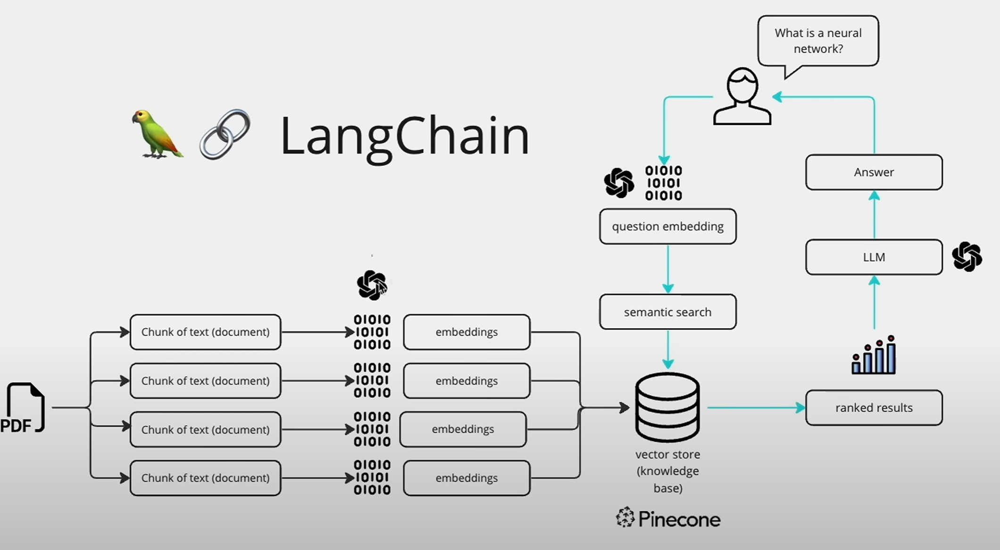

# Developing a Retrieval-Augmented Generation (RAG) application using Langchain and Python (Friday, September 06 2024)

## Introduction

This guide will walk through how to implement an RAG application using Langchain and Python. We will cover how to process user-provided PDF documents for efficient information retrieval and leverage Large Language Models (LLMs) to generate contextually relevant and semantically-driven responses based on the content of those documents.

## What is RAG?

According to AWS, RAG stands for retrieval-augmented generation, "the process of optimizing the output of a large language model ... so it references an authoritative knowledge base outside of its training data sources before generating a response". A common caveat of LLMs is that they are limited to only their pre-trained data and thus cannot reliably act upon proprietary data sources. RAG addresses this by adding an external data retrieval step to pull in and store information from sources such as a document repository in a vector database, thereby allowing LLMS to access such content and act upon dynamic, user-provided data.

The image below nicely visualizes the main steps to a standard RAG workflow. 

*Image credits to Alejandro AO - Software & AI*

Initial Setup:
1. Provide PDF documents as internal data sources
2. Process documents into multiple text chunks
3. Convert text chunks into [vector embeddings](https://www.pinecone.io/learn/vector-embeddings/)
4. Store embeddings into vector database

RAG Process:
1. User asks a question
2. Convert the question into a vector embedding
3. Run a semantic similarity search with the vector database
4. Obtain the top-k best matches and their respective text chunks
5. Feed chunks into LLM along with original question
6. Obtain contextually relevant response from LLM

## Instructions

The tutorial will be split into two main sections. The first will be on creating a RAG project that operates through the terminal. The second expands the project by integrating a user-friendly and interactive UI using Streamlit to create a fully-fledged RAG chatbot.

### Part 1: Constructing a Terminal-Based RAG Application 

Open the [RAG-Tutorial](https://github.com/wkguoKBR/RAG-Tutorial) GitHub repo to follow along and access the entire completed project. 

#### Step 1. Setup environment

1) Run `pip install -r requirements.txt`

   This will install the majority of the required packages for our RAG application. An important one is Langchain, an open-source framework that will provide us with the tools to connect LLMs with external data sources.

   *Note: Your system may still lack certain packages after this step. If you encounter an error regarding a missing package or an unknown function/method in the terminal when running any subsequent commands in this guide, simply pip install the specified package in question.*

2) Add PDFs in `data` folder

   Place your desired PDF documents in the `data` folder. Currently, the folder only has `monoploy.pdf` which specifies the rules of the game.

3) Specify OpenAI API Key in `.env`

   Navigate to the `.env` file and replace 'YOUR_API_KEY' with a valid private OpenAI API key.

#### Step 2. Process PDFs and Populate Vector Database

Our RAG application requires two models: an embedding model and LLM. The embedding model will embed the text chunks and user prompts (it is necessary to use the same embedding function for both). The LLM will take as input user prompts and relevant context from the most similar semantic matches and output a response.

The two options available in the example are to use an embedding model and LLM from either OpenAI or Ollama. 
- [OpenAI](https://openai.com/) offers better embedding functions and generative AI models, although the caveats are that you will require a valid API key and compromise locality.
- [Ollama](https://ollama.com/) offers the benefit of keeping your project fully local. Just download Ollama, pull their `nomic-embed-text` and `llama3` models, and then run `ollama serve` to start the server.

### Part 2: Enhancing the RAG Application with Streamlit UI
